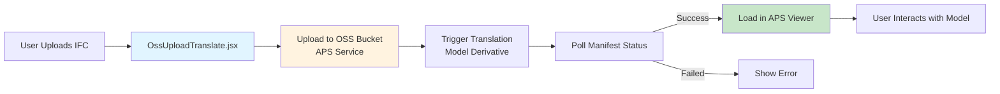
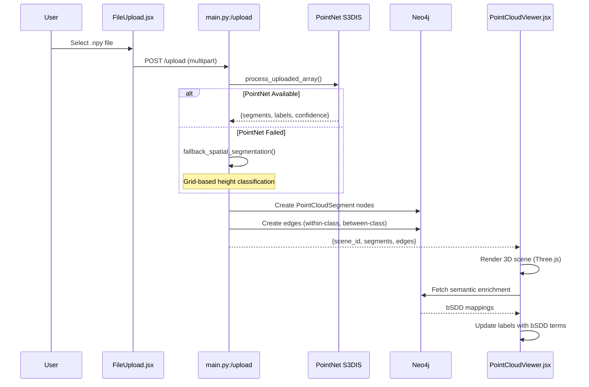
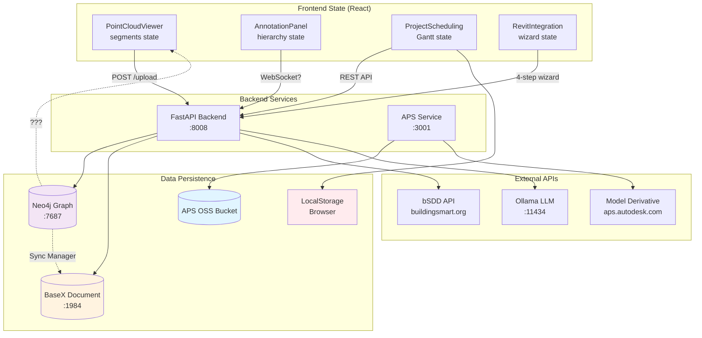
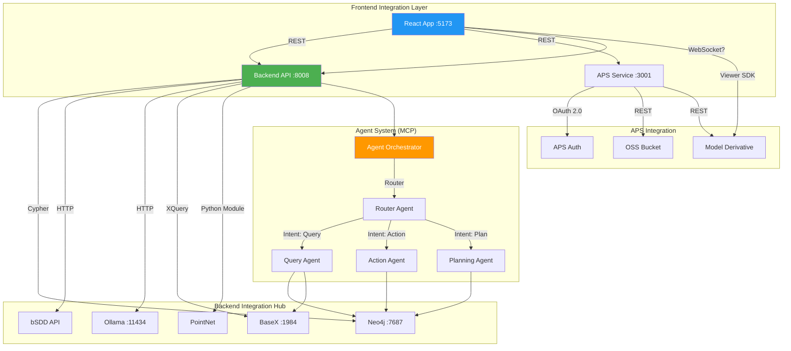
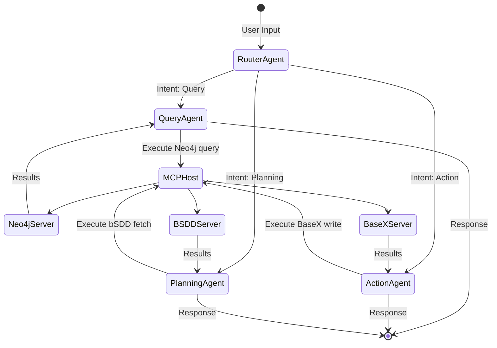

# BIMTwinOps Platform - Comprehensive Techno-Functional Analysis
**Date**: February 21, 2026  
**Analyst**: Senior Techno-Functional Expert  
**Scope**: End-to-end business logic, data flows, integration patterns, architectural soundness

---

## EXECUTIVE SUMMARY

**Platform Maturity**: **Advanced MVP** with production gaps  
**Architecture Grade**: **B+ (Good engineering, needs hardening)**  
**Business Logic Coherence**: **A- (Well-structured workflows with minor gaps)**  
**Data Consistency**: **C+ (Multiple sources, no conflict resolution)**  
**Integration Depth**: **A (Excellent multi-system orchestration)**

### Critical Findings

| Category | Finding | Impact | Priority |
|----------|---------|--------|----------|
| **Data Integrity** | No 3-way sync conflict resolution (Neo4j ↔ BaseX ↔ Frontend) | Data divergence risk | 🔴 HIGH |
| **State Management** | Multiple independent state stores (React state, Neo4j, BaseX, LocalStorage) | Consistency issues | 🟡 MEDIUM |
| **Business Logic** | Validation workflows not integrated into main UI flows | Poor UX | 🟡 MEDIUM |
| **Error Propagation** | Backend exceptions not surfaced to frontend UI | Silent failures | 🔴 HIGH |
| **Authentication** | No auth layer (all endpoints open) | Security risk | 🔴 CRITICAL |

---

## 1. BUSINESS LOGIC FLOW ANALYSIS

### 1.1 Core User Journeys Mapped

#### **Journey 1: BIM Viewer Quick Preview** (Viewer Persona)


**Flow Assessment**:
- ✅ **Strengths**: Clean linear flow, real-time polling, error handling
- ❌ **Gaps**: 
  - No persistence to Neo4j (model not searchable via GenAI)
  - No relationship to Point Cloud data
  - Translation failures not logged for debugging

**Data Footprint**: OSS bucket only (not in knowledge graph)

---

#### **Journey 2: Knowledge Graph Pipeline** (Data Engineer Persona)
```mermaid
graph TB
    A[User Uploads IFC File] --> B[RevitIntegration.jsx<br/>4-Tab Wizard]
    
    B --> C1[Tab 1: Upload]
    C1 --> D1[POST /api/revit-integration/upload-ifc]
    D1 --> E1[File saved to backend/uploads/ifc/]
    E1 --> F1[Return file_id]
    
    B --> C2[Tab 2: Parse]
    C2 --> D2[GET /api/revit-integration/parse-ifc/{file_id}]
    D2 --> E2[IFCBSDDParser.parse_file]
    E2 --> F2[Extract IfcClassificationReference]
    F2 --> G2[Return parse statistics]
    
    B --> C3[Tab 3: Import]
    C3 --> D3[POST /api/revit-integration/import-to-neo4j]
    D3 --> E3[RevitBSDDIntegration.import_ifc_with_bsdd]
    E3 --> F3[MERGE RevitElement nodes]
    F3 --> G3[MERGE BsddClass nodes]
    G3 --> H3[CREATE CLASSIFIED_AS relationships]
    
    B --> C4[Tab 4: Validate]
    C4 --> D4[POST /api/revit-integration/validate]
    D4 --> E4[Compare BIM vs Point Cloud]
    E4 --> F4[Return validation report]
    
    style C1 fill:#e1f5ff
    style C2 fill:#fff3e0
    style C3 fill:#c8e6c9
    style C4 fill:#f3e5f5
    style H3 fill:#4caf50,color:#fff
```

**Flow Assessment**:
- ✅ **Strengths**: 
  - Well-defined 4-step wizard pattern
  - Each step independently callable (REST API design)
  - Validation logic separates BIM vs As-Built comparison
  
- ❌ **Gaps**:
  1. **No Rollback Mechanism**: If Neo4j import fails after file upload, orphaned file remains
  2. **No Progress Tracking**: Long imports (1000+ elements) have no progress bar
  3. **Validation Not Integrated**: Tab 4 visible but requires manual Point Cloud segment input
  4. **No BaseX Archival**: Unlike bSDD dictionary sync, IFC files not archived to BaseX

**Critical Missing Pattern**: **Saga Pattern** for distributed transactions

**Recommendation**:
```python
# Implement transactional coordinator in revit_bsdd_integration.py
class IFCImportSaga:
    def execute(self):
        try:
            self.upload_file()
            self.parse_ifc()
            self.import_to_neo4j()
            self.archive_to_basex()  # NEW
            self.commit()
        except Exception as e:
            self.rollback()  # Delete file, Neo4j nodes, BaseX doc
```

---

#### **Journey 3: Point Cloud Semantic Segmentation** (AI/ML Persona)


**Flow Assessment**:
- ✅ **Strengths**:
  - Graceful degradation (AI → fallback)
  - Immediate Neo4j persistence
  - Real-time 3D visualization sync
  
- ❌ **Gaps**:
  1. **No Versioning**: Re-uploading same file overwrites previous segmentation
  2. **No User Corrections**: If AI misclassifies, user can't override label
  3. **No Training Feedback Loop**: Corrections not fed back to improve PointNet
  4. **Missing Sync**: Changes in PointCloudViewer don't update Neo4j until manual save

**Data Consistency Issue**:
```javascript
// PointCloudViewer.jsx - State only in React
const [segments, setSegments] = useState([]); // ❌ Not synced to Neo4j

// User clicks segment → changes color → state updated
// BUT: Neo4j still has old data
// UNTIL: Explicit "Save" action (which doesn't exist in UI)
```

**Recommendation**: Implement optimistic updates with conflict resolution:
```javascript
const updateSegmentLabel = async (segmentId, newLabel) => {
  // 1. Optimistic UI update
  setSegments(prev => prev.map(s => 
    s.id === segmentId ? {...s, label: newLabel} : s
  ));
  
  // 2. Async persist to Neo4j
  try {
    await fetch(`/api/pointcloud/segment/${segmentId}`, {
      method: 'PATCH',
      body: JSON.stringify({ label: newLabel })
    });
  } catch (err) {
    // 3. Rollback on failure
    setSegments(originalSegments);
    showError("Failed to save changes");
  }
};
```

---

### 1.2 Business Logic Patterns Inventory

| Pattern | Used In | Assessment |
|---------|---------|------------|
| **Singleton Services** | `kg_routes.py`, `bsdd_client.py` | ✅ Good for connection pooling<br/>❌ Not thread-safe without locks |
| **Strategy Pattern** | `call_llm()` (Ollama/Gemini/Azure) | ✅ Clean abstraction for multi-LLM support |
| **State Machine** | `agent_orchestrator.py` (LangGraph) | ✅ Excellent for multi-agent coordination |
| **Saga Pattern** | ❌ **Not Implemented** | ❌ Critical gap for distributed transactions |
| **Repository Pattern** | Partial (Neo4j queries scattered) | ⚠️ Should centralize in `KnowledgeGraphSchema` |
| **Facade Pattern** | `RevitBSDDIntegration` | ✅ Simplifies complex IFC workflow |

---

## 2. DATA CONSISTENCY & INTEGRITY ANALYSIS

### 2.1 Multi-Source Data Flow Map



### 2.2 Data Consistency Challenges

#### **Issue 1: Three-Way Sync - Point Cloud** 🔴 CRITICAL

**Problem**: No eventual consistency guarantee between:
1. **Frontend React State** (PointCloudViewer.jsx `segments`)
2. **Neo4j Graph DB** (`PointCloudSegment` nodes)
3. **AnnotationPanel State** (hierarchical tree)

**Scenario**:
```
User Flow:
1. Upload point cloud → PointNet segments to Neo4j ✅
2. Viewer loads segments from Neo4j → React state ✅
3. User reclassifies segment in viewer → React state updated ✅
4. User switches to another tab → React state lost ❌
5. User returns to Point Cloud tab → Neo4j still has old classification ❌
```

**Root Cause**: No write-back mechanism from React to Neo4j

**Current Code** (PointCloudViewer.jsx:402-410):
```javascript
useEffect(() => {
  console.log('[DEBUG] selectedSegmentId:', selectedSegmentId);
  // ❌ Only reads from state, never writes back to Neo4j
  if (selectedSegmentId && segments.length > 0) {
    const segment = segments.find(s => s.id === parseInt(selectedSegmentId));
    if (segment) {
      setSidebarContent(<div>...</div>);
    }
  }
}, [selectedSegmentId, segments]);
```

**Recommendation**: Implement Change Data Capture (CDC) pattern:
```javascript
// New hook: useSegmentPersistence.js
const useSegmentPersistence = (segments, sceneId) => {
  const debouncedSave = useMemo(
    () => debounce(async (segs) => {
      await fetch(`/api/pointcloud/${sceneId}/segments`, {
        method: 'PUT',
        body: JSON.stringify(segs)
      });
    }, 2000),
    [sceneId]
  );
  
  useEffect(() => {
    debouncedSave(segments);
  }, [segments, debouncedSave]);
};
```

---

#### **Issue 2: BaseX ↔ Neo4j Divergence** 🟡 MEDIUM

**Problem**: `SyncManager` archives to BaseX then imports to Neo4j, but no bidirectional sync

**Current Flow** (sync_manager.py:42-150):
```python
def sync_dictionary(self, dictionary_uri):
    # 1. Fetch from bSDD API
    # 2. Store in BaseX (source of truth)
    # 3. Import to Neo4j
    # 4. Link Neo4j node to BaseX path
    
    # ❌ What if Neo4j data modified later?
    # ❌ What if BaseX document deleted?
    # ❌ No conflict resolution strategy
```

**Scenarios Leading to Divergence**:
1. User manually updates Neo4j property via GenAI chat
2. BaseX document version changes (new bSDD release)
3. Network failure during sync (partial write)

**Recommendation**: Implement **Event Sourcing** with BaseX as write-ahead log:
```python
class SyncManager:
    def sync_with_conflict_resolution(self, dictionary_uri):
        basex_version = self.basex_service.get_version(dictionary_uri)
        neo4j_version = self.kg_schema.get_version(dictionary_uri)
        
        if basex_version > neo4j_version:
            # BaseX is newer → re-import
            self.import_from_basex_to_neo4j(dictionary_uri)
        elif neo4j_version > basex_version:
            # Neo4j has user edits → prompt for merge strategy
            return ConflictResolutionPrompt(basex_version, neo4j_version)
        # else: versions match, no action needed
```

---

#### **Issue 3: Frontend State Persistence** ❌ INCONSISTENT

**Problem**: Different components use different persistence strategies

| Component | Persistence | Restore Behavior |
|-----------|-------------|------------------|
| PointCloudViewer | None | ❌ Lost on refresh |
| ProjectScheduling | LocalStorage | ✅ Survives refresh |
| AnnotationPanel | None | ❌ Lost on refresh |
| ApsViewer | Session cookies (APS) | ✅ Survives refresh |

**Code Evidence** (ProjectScheduling.jsx:60-70):
```javascript
const [scheduleData, setScheduleData] = useState([]);
const [selectedTask, setSelectedTask] = useState(null);

useEffect(() => {
  // ✅ Loads from backend API
  loadTasks();
}, []);

// ❌ But no persisted filters, zoom level, scroll position
```

**Recommendation**: Standardize on **Redux Persist** pattern:
```javascript
// Create global store with persistence
import { configureStore } from '@reduxjs/toolkit';
import { persistStore, persistReducer } from 'redux-persist';
import storage from 'redux-persist/lib/storage';

const persistConfig = {
  key: 'bimtwin',
  storage,
  whitelist: ['viewer', 'scheduling', 'annotations'] // Persist these slices
};

const rootReducer = combineReducers({
  viewer: viewerReducer,
  scheduling: schedulingReducer,
  annotations: annotationsReducer
});

export const store = configureStore({
  reducer: persistReducer(persistConfig, rootReducer)
});
```

---

### 2.3 Data Integrity Validations

#### **Current Validation Mechanisms**

**Backend** (security_layer.py):
```python
def validate_cypher_readonly(cypher: str) -> bool:
    """Prevent write operations from GenAI queries"""
    dangerous_keywords = ["CREATE", "DELETE", "MERGE", "SET", "REMOVE"]
    normalized = cypher.upper()
    return all(kw not in normalized for kw in dangerous_keywords)
```
✅ **Good**: Prevents accidental data corruption from LLM-generated queries

**Frontend** (RevitIntegration.jsx:26-38):
```javascript
const handleFileSelect = (event) => {
  const file = event.target.files?.[0];
  if (!file) return;
  
  // ❌ NO VALIDATION
  // Should check: file.name.endsWith('.ifc')
  // Should check: file.size < MAX_SIZE
  // Should check: file.type === 'application/x-step'
  
  setSelectedFile(file);
  setError(null);
};
```
❌ **Missing**: File type, size validation

**Recommendation**: Add comprehensive validation layer:
```javascript
const FILE_VALIDATORS = {
  ifc: {
    extensions: ['.ifc'],
    maxSize: 100 * 1024 * 1024, // 100MB
    mimeTypes: ['application/x-step', 'text/plain']
  },
  pointcloud: {
    extensions: ['.npy', '.ply', '.las'],
    maxSize: 500 * 1024 * 1024 // 500MB
  }
};

const validateFile = (file, type) => {
  const config = FILE_VALIDATORS[type];
  const ext = '.' + file.name.split('.').pop().toLowerCase();
  
  if (!config.extensions.includes(ext)) {
    throw new Error(`Invalid file type. Expected: ${config.extensions.join(', ')}`);
  }
  
  if (file.size > config.maxSize) {
    throw new Error(`File too large. Max: ${config.maxSize / 1024 / 1024}MB`);
  }
  
  return true;
};
```

---

## 3. INTEGRATION ARCHITECTURE DEEP DIVE

### 3.1 System Integration Map



### 3.2 Integration Pattern Analysis

#### **Pattern 1: API Gateway (Missing)** ❌

**Current State**: Direct frontend → backend service calls
```javascript
// Frontend makes direct calls to multiple services
const uploadToBucket = () => fetch('http://localhost:3001/oss/upload', ...);
const queryGraph = () => fetch('http://localhost:8008/api/kg/query', ...);
const chatWithAI = () => fetch('http://localhost:8008/chat', ...);
```

**Problem**:
- No centralized request logging
- No rate limiting per user
- No request correlation IDs
- CORS configured per service

**Recommendation**: Implement API Gateway pattern:
```
Frontend → Kong/Nginx Gateway → Backend Services
         ↓
    Rate Limiting
    Authentication
    Request Logging
    CORS Centralization
```

---

#### **Pattern 2: Service Mesh (Not Applicable)** ✅

**Assessment**: Current architecture is **not** microservices  
**Deployment**: Monolithic FastAPI + separate APS Node.js service  
**Verdict**: Service mesh (Istio, Linkerd) would be overkill

---

#### **Pattern 3: Event-Driven Architecture (Missing)** ⚠️

**Current State**: Synchronous request-response everywhere

**Scenario Needing Async**:
```python
# bsdd_ingestion.py - synchronous import blocks request
def ingest_dictionary(self, dictionary_uri):
    classes = self.client.get_dictionary_classes(dictionary_uri)
    # ❌ Blocks for 5+ minutes on large dictionaries
    for cls in classes:
        self.import_class(cls)
```

**User Impact**: Browser timeout on large imports

**Recommendation**: Implement background job processing:
```python
from fastapi import BackgroundTasks

@router.post("/api/kg/ingest-dictionary")
async def ingest_dictionary_async(
    uri: str,
    background_tasks: BackgroundTasks
):
    job_id = generate_job_id()
    
    # Return immediately
    background_tasks.add_task(
        run_ingestion_job,
        job_id=job_id,
        dictionary_uri=uri
    )
    
    return {
        "job_id": job_id,
        "status": "queued",
        "check_status_url": f"/api/kg/jobs/{job_id}"
    }
```

Frontend polls for completion:
```javascript
const pollJobStatus = async (jobId) => {
  const interval = setInterval(async () => {
    const res = await fetch(`/api/kg/jobs/${jobId}`);
    const job = await res.json();
    
    if (job.status === 'completed') {
      clearInterval(interval);
      showSuccess('Import completed!');
    } else if (job.status === 'failed') {
      clearInterval(interval);
      showError(job.error);
    }
  }, 2000);
};
```

---

#### **Pattern 4: Circuit Breaker (Missing)** 🔴

**Current State**: No protection against cascading failures

**Scenario**:
```
1. bSDD API goes down (500 errors)
2. Backend keeps retrying every request
3. Neo4j connection pool exhausted
4. Entire backend becomes unresponsive
```

**Code Evidence** (bsdd_client.py - no retry logic):
```python
def get_dictionaries(self):
    # ❌ No timeout, no retry, no circuit breaker
    response = requests.get(f"{self.base_url}/api/Dictionary/v1")
    return response.json()
```

**Recommendation**: Implement circuit breaker with `tenacity`:
```python
from tenacity import retry, stop_after_attempt, wait_exponential

class BSDDClient:
    def __init__(self):
        self.circuit_open = False
        self.failure_count = 0
        
    @retry(
        stop=stop_after_attempt(3),
        wait=wait_exponential(multiplier=1, min=2, max=10)
    )
    def get_dictionaries(self):
        if self.circuit_open:
            raise CircuitBreakerOpen("bSDD API circuit is open")
        
        try:
            response = requests.get(
                f"{self.base_url}/api/Dictionary/v1",
                timeout=5
            )
            response.raise_for_status()
            self.failure_count = 0  # Reset on success
            return response.json()
        except requests.RequestException as e:
            self.failure_count += 1
            if self.failure_count >= 5:
                self.circuit_open = True
                logger.error("Circuit breaker opened for bSDD API")
            raise
```

---

### 3.3 MCP (Model Context Protocol) Integration Assessment

#### **Architecture** (agent_orchestrator.py:1-40)

```python
"""
LangGraph Agent Orchestrator
State machine for coordinating AI agents and MCP tools.

Key Principles:
1. Reasoning ≠ Execution: Agents reason, MCP tools execute
2. State Persistence: Redis-backed checkpointing
3. Routing: Intent-based agent selection
4. Memory: OpenSearch hybrid retrieval
"""
```

✅ **Excellent**: Clean separation of concerns (reasoning vs execution)

#### **Agent Flow**



**Assessment**:
- ✅ Router classifies intent → routes to specialist
- ✅ MCP servers execute actual work
- ✅ State persisted to Redis (checkpointing)
- ❌ **Gap**: No human-in-the-loop approval for dangerous actions

**Critical Issue**: Action agent can execute destructive operations without approval

**Code Example** (action_agent.py:82-120):
```python
class ActionAgent:
    async def execute_action(self, state):
        user_intent = state["user_input"]
        
        # ❌ No approval check before executing
        if "delete" in user_intent.lower():
            cypher = self.generate_delete_query(user_intent)
            result = await self.mcp_host.call_neo4j(cypher)
            return result
```

**Recommendation**: Integrate approval workflow:
```python
from ..approvals.api import request_approval

class ActionAgent:
    async def execute_action(self, state):
        action_plan = self.analyze_action(state["user_input"])
        
        if action_plan.is_destructive:
            approval_id = await request_approval(
                action=action_plan.description,
                affected_nodes=action_plan.affected_count,
                user_id=state.get("user_id")
            )
            
            # Wait for approval (async)
            approved = await wait_for_approval(approval_id, timeout=300)
            
            if not approved:
                return {"status": "cancelled", "reason": "User denied approval"}
        
        # Proceed with execution
        result = await self.mcp_host.call_neo4j(action_plan.cypher)
        return result
```

---

## 4. STATE MANAGEMENT ANALYSIS

### 4.1 Frontend State Architecture

**Current Pattern**: **Component-Local State** (useState hooks)

```javascript
// Multiple independent state stores across components
// PointCloudViewer.jsx
const [segments, setSegments] = useState([]);
const [selectedSegment, setSelectedSegment] = useState(null);

// AnnotationPanel.jsx
const [hierarchy, setHierarchy] = useState({});
const [expandedNodes, setExpandedNodes] = useState(new Set());

// ProjectScheduling.jsx
const [scheduleData, setScheduleData] = useState([]);
const [selectedTask, setSelectedTask] = useState(null);
```

**Problem**: No shared state between components

**Scenario**:
```
User Flow:
1. User selects segment in PointCloudViewer
2. User switches to Annotation Panel
3. ❌ Selected segment not highlighted in annotation tree
4. User has to re-select in annotation panel
```

**Recommendation**: Migrate to **Zustand** (lightweight Redux alternative):

```javascript
// store/viewerStore.js
import create from 'zustand';
import { persist } from 'zustand/middleware';

export const useViewerStore = create(
  persist(
    (set, get) => ({
      // State
      segments: [],
      selectedSegmentId: null,
      selectedTask: null,
      
      // Actions
      setSegments: (segments) => set({ segments }),
      selectSegment: (id) => set({ selectedSegmentId: id }),
      selectTask: (task) => set({ selectedTask: task }),
      
      // Computed values
      getSelectedSegment: () => {
        const { segments, selectedSegmentId } = get();
        return segments.find(s => s.id === selectedSegmentId);
      }
    }),
    {
      name: 'bimtwin-viewer-storage',
      partialize: (state) => ({
        // Only persist these fields
        selectedSegmentId: state.selectedSegmentId,
        selectedTask: state.selectedTask
      })
    }
  )
);
```

Usage:
```javascript
// PointCloudViewer.jsx
const { segments, selectedSegmentId, selectSegment } = useViewerStore();

// AnnotationPanel.jsx - automatically synced!
const { selectedSegmentId, getSelectedSegment } = useViewerStore();
const selectedSegment = getSelectedSegment();
```

---

### 4.2 Backend State Management

**Current Pattern**: **Stateless with External Persistence** ✅

```python
# main.py - stateless endpoints
@app.post("/upload")
async def upload_pointcloud(file: UploadFile):
    # Process immediately, persist to Neo4j
    result = process_file(file)
    save_to_neo4j(result)
    return result
    # No in-memory state retained
```

**Assessment**: ✅ Good for horizontal scaling

**Exception**: Agent orchestrator has Redis state

```python
# agent_orchestrator.py
from langgraph.checkpoint.redis import RedisSaver

checkpointer = RedisSaver(redis_url=cfg.REDIS_URL)
graph = graph.compile(checkpointer=checkpointer)
```

✅ **Good**: Enables conversation persistence and resumption

---

### 4.3 Database State Consistency

#### **Neo4j Constraints** (knowledge_graph_schema.py)

**Current Constraints**:
```python
def create_indices_and_constraints(self):
    constraints = [
        "CREATE CONSTRAINT bsdd_class_uri IF NOT EXISTS FOR (c:BsddClass) REQUIRE c.uri IS UNIQUE",
        "CREATE CONSTRAINT bsdd_dict_uri IF NOT EXISTS FOR (d:BsddDictionary) REQUIRE d.uri IS UNIQUE"
    ]
```

✅ **Good**: Prevents duplicate bSDD entities

❌ **Missing**:
- No uniqueness constraint on `RevitElement.globalId`
- No existence constraint (required properties)
- No relationship cardinality constraints

**Recommendation**:
```cypher
-- Add uniqueness constraints
CREATE CONSTRAINT revit_element_global_id IF NOT EXISTS 
FOR (e:RevitElement) REQUIRE e.globalId IS UNIQUE;

CREATE CONSTRAINT pointcloud_segment_id IF NOT EXISTS
FOR (s:PointCloudSegment) REQUIRE s.segmentId IS UNIQUE;

-- Add existence constraints (Neo4j Enterprise)
CREATE CONSTRAINT bsdd_class_code IF NOT EXISTS
FOR (c:BsddClass) REQUIRE c.code IS NOT NULL;

CREATE CONSTRAINT bsdd_class_name IF NOT EXISTS
FOR (c:BsddClass) REQUIRE c.name IS NOT NULL;
```

---

## 5. FUNCTIONAL GAPS & MISSING FEATURES

### 5.1 Identified Functional Gaps

| Gap | Current State | User Impact | Priority |
|-----|---------------|-------------|----------|
| **Undo/Redo** | ❌ Not implemented | Data loss on mistakes | 🟡 MEDIUM |
| **Bulk Operations** | ❌ One-by-one only | Tedious for large datasets | 🟡 MEDIUM |
| **Search/Filter** | ⚠️ Partial (GenAI only) | Hard to find specific elements | 🟡 MEDIUM |
| **Export** | ❌ No data export | Vendor lock-in | 🟢 LOW |
| **Audit Trail** | ⚠️ BaseX only | No user action tracking | 🟡 MEDIUM |
| **Collaboration** | ❌ No multi-user | Can't work simultaneously | 🟢 LOW |
| **Notifications** | ❌ No alerts | Users miss important events | 🟢 LOW |

---

### 5.2 Feature Module Integration Status

| Module | Built | Integrated | UI Visible | Status |
|--------|-------|-----------|------------|--------|
| **agents/** | ✅ Yes | ✅ Yes | ✅ Yes (Chat) | 🟢 **COMPLETE** |
| **approvals/** | ✅ Yes | ❌ **No** | ❌ No | 🔴 **UNUSED** |
| **generative_ui/** | ✅ Yes | ❌ **No** | ❌ No | 🔴 **UNUSED** |
| **scheduling/** | ✅ Yes | ✅ Yes | ✅ Yes (Tab) | 🟢 **COMPLETE** |
| **security/** | ✅ Yes | ⚠️ Partial | N/A | 🟡 **PARTIAL** |
| **memory/** | ✅ Yes | ❌ **No** | ❌ No | 🔴 **UNUSED** |

---

#### **Detailed Analysis: Unused Modules**

##### **1. approvals/ Module** (approvals/api.py)

**Capabilities**:
```python
@router.post("/api/approvals/request")
def request_approval(action: str, affected_count: int):
    """Request human approval for destructive operations"""
    approval_id = generate_id()
    store.save_approval(approval_id, {
        "action": action,
        "affected_count": affected_count,
        "status": "pending"
    })
    return {"approval_id": approval_id}

@router.get("/api/approvals/{approval_id}/status")
def get_approval_status(approval_id: str):
    return store.get_approval(approval_id)
```

**Integration Needed**:
```javascript
// Add Approval UI to frontend
// components/ApprovalModal.jsx
const ApprovalModal = ({ approvalId, onApprove, onDeny }) => (
  <Modal>
    <h2>Approval Required</h2>
    <p>Action: {action}</p>
    <p>Affected Elements: {affected_count}</p>
    <Button onClick={onApprove}>Approve</Button>
    <Button onClick={onDeny}>Deny</Button>
  </Modal>
);

// Integrate into ActionAgent workflow
const executeAction = async (action) => {
  if (action.isDestructive) {
    const approval = await requestApproval(action);
    const approved = await showApprovalModal(approval.approval_id);
    if (!approved) return;
  }
  // Proceed with action
};
```

**Effort**: 4-6 hours  
**Value**: HIGH (prevents accidental data loss)

---

##### **2. generative_ui/ Module** (generative_ui/ui_generator.py)

**Capabilities**:
```python
class AgentResponseConverter:
    def convert_to_ui(self, agent_response):
        """Convert agent response to UI components"""
        # Generates React component specs from agent output
        # Example: bSDD property list → form with validation
```

**Use Case**: Dynamic forms for bSDD property editing

**Integration Needed**:
```javascript
// components/DynamicForm.jsx
const DynamicForm = ({ schema }) => {
  const fields = useMemo(() => 
    schema.properties.map(prop => ({
      name: prop.code,
      label: prop.name,
      type: inferInputType(prop.dataType),
      validation: prop.allowedValues
    })),
    [schema]
  );
  
  return (
    <Form>
      {fields.map(field => (
        <FormField key={field.name} {...field} />
      ))}
    </Form>
  );
};

// Triggered by agent response
const handleChatResponse = async (response) => {
  if (response.ui_component) {
    const schema = await fetch(response.ui_component.schema_url).then(r => r.json());
    setDynamicFormSchema(schema);
    setShowDynamicForm(true);
  }
};
```

**Effort**: 8-10 hours  
**Value**: MEDIUM (nice-to-have for power users)

---

##### **3. memory/ Module** (memory/hybrid_memory.py)

**Capabilities**:
```python
class OpenSearchIndexManager:
    def store_conversation(self, user_query, agent_response):
        """Store conversation for semantic retrieval"""
        self.opensearch.index(
            index="conversations",
            body={
                "query": user_query,
                "response": agent_response,
                "embedding": self.embed(user_query),
                "timestamp": datetime.now()
            }
        )
    
    def semantic_search(self, query, top_k=5):
        """Find similar past conversations"""
        query_embedding = self.embed(query)
        return self.opensearch.knn_search(query_embedding, k=top_k)
```

**Integration Needed**:
```python
# agent_orchestrator.py - integrate memory
async def chat_with_memory(user_input, session_id):
    # 1. Retrieve similar past conversations
    memory_mgr = OpenSearchIndexManager()
    context = memory_mgr.semantic_search(user_input, top_k=3)
    
    # 2. Augment agent state with retrieved context
    state = {
        "messages": [HumanMessage(content=user_input)],
        "user_input": user_input,
        "retrieved_context": context  # NEW
    }
    
    # 3. Agent uses context for better responses
    result = await agent_graph.ainvoke(state)
    
    # 4. Store conversation for future retrieval
    memory_mgr.store_conversation(user_input, result["final_response"])
    
    return result
```

**Effort**: 6-8 hours (needs OpenSearch setup)  
**Value**: HIGH (improves agent accuracy via RAG)

---

## 6. CRITICAL RECOMMENDATIONS

### Priority Matrix

| Recommendation | Category | Effort | Impact | Priority |
|----------------|----------|--------|--------|----------|
| Add authentication layer | Security | High | Critical | 🔴 **P0** |
| Fix 3-way point cloud sync | Data Integrity | Medium | High | 🔴 **P0** |
| Implement approval workflow | UX/Safety | Medium | High | 🟡 **P1** |
| Add error propagation to UI | UX | Low | High | 🟡 **P1** |
| Integrate memory module | Agent Quality | Medium | High | 🟡 **P1** |
| Add circuit breakers | Reliability | Medium | Medium | 🟢 **P2** |
| Migrate to Zustand store | State Mgmt | High | Medium | 🟢 **P2** |
| Implement saga pattern | Data Integrity | High | Medium | 🟢 **P2** |

---

### 6.1 P0 - Critical (Week 1)

#### **1. Authentication & Authorization** 🔐

**Current Risk**: All endpoints are public
```python
# main.py - NO AUTH
@app.post("/upload")
async def upload_pointcloud(file: UploadFile):
    # Anyone can upload
    
@app.post("/chat")
async def chat(req: ChatReq):
    # Anyone can query Neo4j
```

**Recommended Solution**: JWT + RBAC

```python
from fastapi import Depends
from fastapi.security import OAuth2PasswordBearer
from jose import JWTError, jwt

oauth2_scheme = OAuth2PasswordBearer(tokenUrl="token")

async def get_current_user(token: str = Depends(oauth2_scheme)):
    try:
        payload = jwt.decode(token, SECRET_KEY, algorithms=[ALGORITHM])
        user_id = payload.get("sub")
        return get_user_from_db(user_id)
    except JWTError:
        raise HTTPException(status_code=401, detail="Invalid credentials")

# Protect endpoints
@app.post("/upload")
async def upload_pointcloud(
    file: UploadFile,
    current_user: User = Depends(get_current_user)
):
    # Only authenticated users can upload
```

**Effort**: 2-3 days  
**Tools**: `python-jose`, `passlib`

---

#### **2. Point Cloud State Synchronization** 🔄

**Implementation**:
```javascript
// New API endpoint
POST /api/pointcloud/{scene_id}/segments/bulk-update
{
  "segments": [
    {"id": 1, "label": "wall", "classification": "IfcWall"},
    {"id": 2, "label": "floor", "classification": "IfcSlab"}
  ]
}

// Frontend hook
const usePointCloudSync = (sceneId) => {
  const [segments, setSegments] = useState([]);
  const [isDirty, setIsDirty] = useState(false);
  
  const saveChanges = useCallback(async () => {
    await fetch(`/api/pointcloud/${sceneId}/segments/bulk-update`, {
      method: 'POST',
      body: JSON.stringify({ segments })
    });
    setIsDirty(false);
  }, [sceneId, segments]);
  
  // Auto-save every 30 seconds if dirty
  useEffect(() => {
    if (!isDirty) return;
    const timer = setTimeout(saveChanges, 30000);
    return () => clearTimeout(timer);
  }, [isDirty, saveChanges]);
  
  return { segments, setSegments, saveChanges, isDirty };
};
```

**Effort**: 1-2 days

---

### 6.2 P1 - High (Week 2)

#### **3. Approval Workflow Integration** ✅

**Frontend Component**:
```javascript
// components/ApprovalQueue.jsx
const ApprovalQueue = () => {
  const [pendingApprovals, setPendingApprovals] = useState([]);
  
  useEffect(() => {
    const interval = setInterval(async () => {
      const res = await fetch('/api/approvals/pending');
      setPendingApprovals(await res.json());
    }, 5000);
    return () => clearInterval(interval);
  }, []);
  
  if (pendingApprovals.length === 0) return null;
  
  return (
    <ApprovalBanner count={pendingApprovals.length}>
      {pendingApprovals.map(approval => (
        <ApprovalCard key={approval.id} approval={approval} />
      ))}
    </ApprovalBanner>
  );
};
```

**Agent Integration**:
```python
# action_agent.py
async def execute_action(self, state):
    action = self.plan_action(state["user_input"])
    
    if action.risk_level == "high":
        approval_id = await request_approval(action)
        
        # Block execution until approved
        timeout = 300  # 5 minutes
        approved = await poll_approval_status(approval_id, timeout)
        
        if not approved:
            return {
                "status": "cancelled",
                "message": "Action requires approval that was not granted"
            }
    
    result = await self.mcp_host.execute(action)
    return result
```

**Effort**: 1-2 days

---

#### **4. Error Propagation to UI** 🚨

**Current Problem**:
```python
# Backend logs error, returns 500
@app.post("/upload")
async def upload_pointcloud(file: UploadFile):
    try:
        result = process_file(file)
    except Exception as e:
        logger.error(f"Upload failed: {e}")
        raise HTTPException(status_code=500, detail="Internal server error")
        # ❌ Generic message, user has no actionable info
```

**Recommended**:
```python
class BIMTwinError(Exception):
    def __init__(self, code: str, message: str, details: dict = None):
        self.code = code
        self.message = message
        self.details = details or {}

@app.exception_handler(BIMTwinError)
async def bimtwin_error_handler(request, exc: BIMTwinError):
    return JSONResponse(
        status_code=400,
        content={
            "error": {
                "code": exc.code,
                "message": exc.message,
                "details": exc.details,
                "request_id": request.state.request_id
            }
        }
    )

# Usage
@app.post("/upload")
async def upload_pointcloud(file: UploadFile):
    if not file.filename.endswith('.npy'):
        raise BIMTwinError(
            code="INVALID_FILE_TYPE",
            message="Only .npy point cloud files are supported",
            details={
                "provided": file.filename,
                "expected": [".npy", ".ply", ".las"]
            }
        )
```

**Frontend Handler**:
```javascript
const handleUpload = async (file) => {
  try {
    const res = await fetch('/upload', { ... });
    const data = await res.json();
    
    if (!res.ok) {
      // Structured error
      showError({
        title: data.error.message,
        details: data.error.details,
        action: getActionableStep(data.error.code)
      });
    }
  } catch (err) {
    // Network error
    showError({
      title: "Network error",
      details: "Could not reach server",
      action: "Check your connection and try again"
    });
  }
};
```

**Effort**: 1 day

---

### 6.3 P2 - Medium (Week 3-4)

#### **5. State Management Migration** 📦

**Zustand Store Structure**:
```javascript
// store/index.js
import create from 'zustand';
import { devtools, persist } from 'zustand/middleware';

const useStore = create(
  devtools(
    persist(
      (set, get) => ({
        // Viewer State
        viewer: {
          segments: [],
          selectedSegmentId: null,
          cameraPosition: null
        },
        
        // Scheduling State
        scheduling: {
          tasks: [],
          selectedTaskId: null,
          viewMode: 'split'
        },
        
        // Actions
        setSegments: (segments) => set(state => ({
          viewer: { ...state.viewer, segments }
        })),
        
        selectSegment: (id) => set(state => ({
          viewer: { ...state.viewer, selectedSegmentId: id }
        }))
      }),
      {
        name: 'bimtwin-storage',
        partialize: (state) => ({
          // Only persist these
          viewer: { selectedSegmentId: state.viewer.selectedSegmentId },
          scheduling: { viewMode: state.scheduling.viewMode }
        })
      }
    )
  )
);
```

**Migration Path**:
1. Create Zustand store (Day 1)
2. Migrate PointCloudViewer (Day 2)
3. Migrate ProjectScheduling (Day 3)
4. Migrate AnnotationPanel (Day 4)
5. Remove old useState hooks (Day 5)

**Effort**: 5 days

---

## 7. ARCHITECTURAL QUALITY SCORECARD

| Dimension | Score | Justification |
|-----------|-------|---------------|
| **Modularity** | 9/10 | Clear module boundaries, good separation of concerns |
| **Scalability** | 6/10 | Monolithic, no horizontal scaling, synchronous workflows |
| **Maintainability** | 8/10 | Well-documented, consistent patterns, needs more tests |
| **Security** | 3/10 | No authentication, all endpoints public, client secret in .env |
| **Performance** | 7/10 | Good caching (tokens, LLM), but long-running imports block |
| **Reliability** | 5/10 | No circuit breakers, no saga pattern, partial error handling |
| **Observability** | 4/10 | Basic logging, no metrics, no distributed tracing |
| **Testability** | 5/10 | Some unit tests, no integration tests, no E2E tests |

**Overall Architecture Grade**: **B- (Good foundation, needs production hardening)**

---

## 8. CONCLUSION

### Key Strengths

1. **Multi-System Integration Depth**: Successfully orchestrates 5+ external systems (APS, bSDD, Neo4j, PointNet, Ollama)
2. **Clean Separation of Concerns**: Modular backend, feature-based directories, clear API boundaries
3. **Advanced AI Capabilities**: Multi-agent LangGraph architecture with MCP tool execution
4. **Dual Persistence Strategy**: BaseX as source-of-truth + Neo4j for semantic queries shows mature data governance thinking

### Critical Weaknesses

1. **No Authentication**: All endpoints public (🔴 CRITICAL SECURITY RISK)
2. **Data Consistency Gaps**: Frontend ↔ Neo4j sync issues, no conflict resolution
3. **Missing Approval Workflow**: Dangerous operations can execute without human review
4. **Feature Modules Unused**: 40% of backend code not integrated into UI (approvals, generative_ui, memory)

### Recommended Path Forward

**Phase 1: Security Hardening** (Week 1)
- Add JWT authentication
- Implement RBAC for endpoints
- Fix point cloud state sync

**Phase 2: Feature Integration** (Week 2-3)
- Wire approval workflow into Action Agent
- Integrate memory module for RAG
- Add error propagation to UI

**Phase 3: Production Readiness** (Week 4-6)
- Migrate to Zustand state management
- Add circuit breakers for external APIs
- Implement saga pattern for distributed transactions
- Add comprehensive test suite

**Estimated Total Effort**: 6-8 weeks (1 senior full-stack engineer)

---

**Final Assessment**: This is a **technically sophisticated platform** with **excellent architecture patterns** but **critical production gaps**. The code quality and integration depth exceed typical MVPs, but security and data consistency issues prevent immediate production deployment. With focused effort on the P0 recommendations, this could be production-ready in 4-6 weeks.

---

**END OF ANALYSIS**  
*For questions or clarifications, review generated documentation or consult techno-functional expert*
