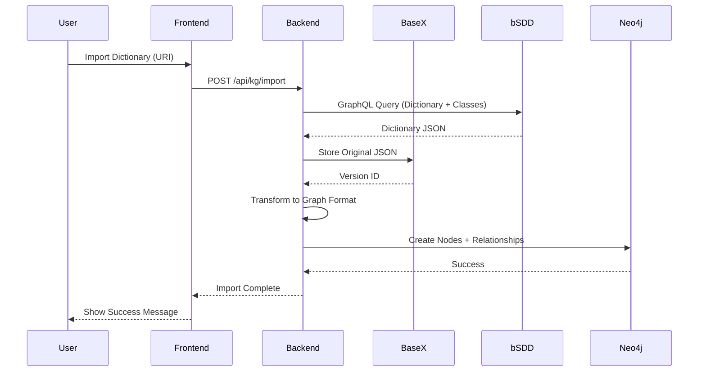
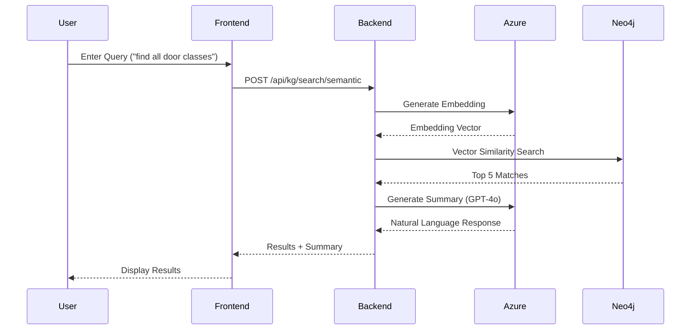
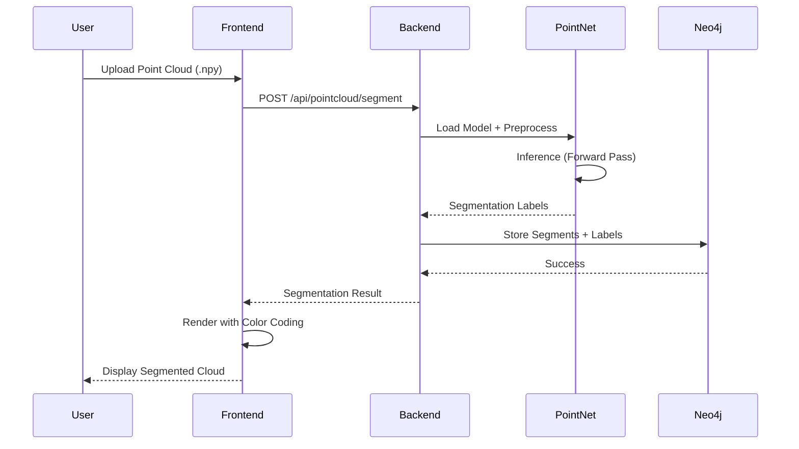
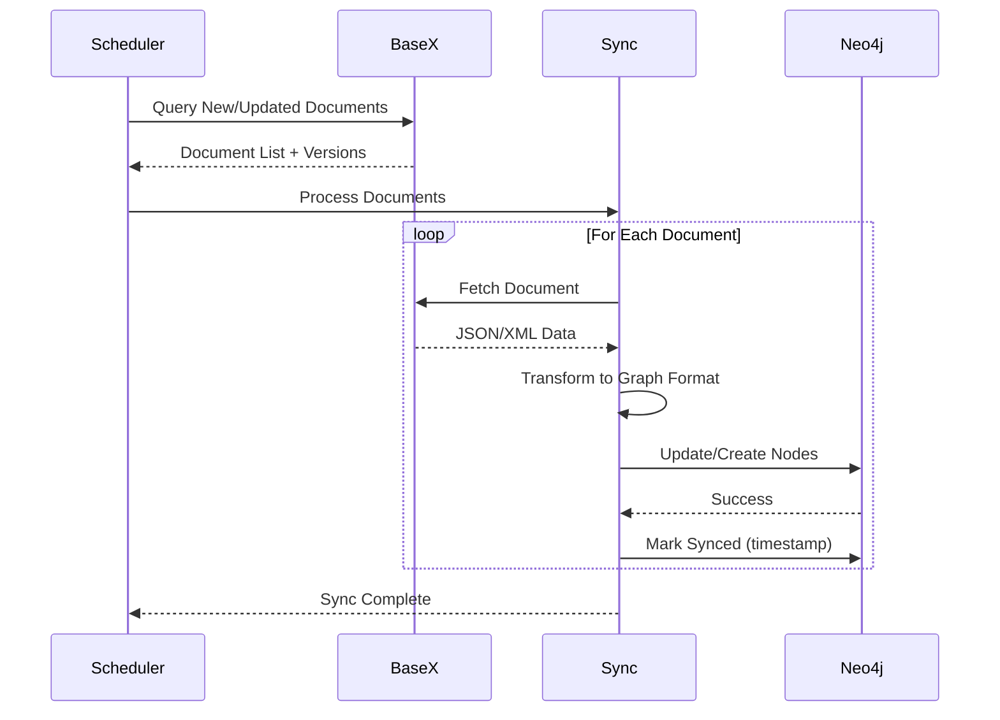

# BIMTwinOps Component Architecture

## System Overview

This document provides a detailed component-level view of the BIMTwinOps platform architecture, showing all major components, their responsibilities, and interactions.

## Component Diagram

```mermaid
graph TB
    subgraph "Frontend Layer (React + Vite)"
        FE_Main[App.jsx<br/>Main Application Router]
        FE_APS[ApsViewer Component<br/>Autodesk Viewer + 40+ Extensions]
        FE_PC[PointCloudViewer Component<br/>Three.js + PointNet AI]
        FE_Graph[GraphViewer Component<br/>Force-Directed Graph D3.js]
        FE_Chat[AI Chat Component<br/>GenAI Assistant]
        FE_KG[Knowledge Graph Browser<br/>bSDD Explorer]
        FE_Anno[AnnotationPanel Component<br/>Hierarchical Tree]
        FE_API[API Client Layer<br/>api.jsx]
    end

    subgraph "Backend Services Layer (FastAPI + Node.js)"
        BE_Main[main.py<br/>FastAPI Main App]
        BE_KG[kg_routes.py<br/>Knowledge Graph API]
        BE_GraphQL[kg_graphql.py<br/>GraphQL API Layer]
        BE_BSDD[bsdd_client.py<br/>bSDD API Client]
        BE_GenAI[genai_service.py<br/>Azure OpenAI Service]
        BE_Schema[knowledge_graph_schema.py<br/>Neo4j Schema Manager]
        BE_Ingest[bsdd_ingestion.py<br/>Data Ingestion Pipeline]
        BE_BaseX[basex_client.py<br/>BaseX Document Manager]
        BE_APS[APS Service (Node.js)<br/>OAuth + OSS + Model Derivative]
        BE_PointNet[online_segmentation.py<br/>PointNet Inference Engine]
    end

    subgraph "Database Layer"
        DB_Neo4j[(Neo4j Graph Database<br/>────────────<br/>• Semantic Relationships<br/>• Real-time Queries<br/>• Cypher Patterns<br/>• Spatial Data)]
        DB_BaseX[(BaseX Document DB<br/>────────────<br/>• Original Documents<br/>• Version Management<br/>• Audit Trail<br/>• XQuery Processing)]
    end

    subgraph "External Services"
        EXT_BSDD[buildingSMART bSDD API<br/>────────────<br/>• GraphQL Endpoint<br/>• REST Endpoints<br/>• 100+ Dictionaries]
        EXT_Azure[Azure OpenAI GPT-4o<br/>────────────<br/>• Text Generation<br/>• Embeddings<br/>• RAG Pattern]
        EXT_APS[Autodesk Platform Services<br/>────────────<br/>• 3-Legged OAuth<br/>• OSS (Object Storage)<br/>• Model Derivative]
    end

    subgraph "ML Models"
        ML_PointNet[PointNet S3DIS Model<br/>────────────<br/>• Semantic Segmentation<br/>• 13-Class Classification<br/>• PyTorch Implementation]
    end

    %% Frontend to API Layer
    FE_Main --> FE_APS
    FE_Main --> FE_PC
    FE_Main --> FE_Graph
    FE_Main --> FE_Chat
    FE_Main --> FE_KG
    FE_Main --> FE_Anno
    FE_APS --> FE_API
    FE_PC --> FE_API
    FE_Graph --> FE_API
    FE_Chat --> FE_API
    FE_KG --> FE_API
    FE_Anno --> FE_API

    %% API to Backend Services
    FE_API -->|REST + GraphQL| BE_Main
    FE_API -->|REST| BE_APS

    %% Backend Internal Components
    BE_Main --> BE_KG
    BE_Main --> BE_GraphQL
    BE_KG --> BE_Schema
    BE_KG --> BE_GenAI
    BE_KG --> BE_BSDD
    BE_KG --> BE_Ingest
    BE_GraphQL --> BE_Schema
    BE_Ingest --> BE_BSDD
    BE_Ingest --> BE_Schema
    BE_Ingest --> BE_BaseX
    BE_Schema --> BE_BaseX

    %% Backend to Databases
    BE_Schema -->|Cypher Queries| DB_Neo4j
    BE_BaseX -->|XQuery| DB_BaseX
    BE_PointNet -->|Store Segments| DB_Neo4j
    DB_BaseX -.->|Sync| DB_Neo4j

    %% Backend to External Services
    BE_BSDD -->|GraphQL/REST| EXT_BSDD
    BE_GenAI -->|API Calls| EXT_Azure
    BE_APS -->|OAuth/API| EXT_APS
    FE_APS -->|Direct Viewer API| EXT_APS

    %% ML Integration
    FE_PC -->|Point Cloud Data| BE_PointNet
    BE_PointNet -->|Load Model| ML_PointNet

    %% Styling
    classDef frontend fill:#e1f5ff,stroke:#01579b,stroke-width:2px
    classDef backend fill:#fff3e0,stroke:#e65100,stroke-width:2px
    classDef database fill:#f3e5f5,stroke:#4a148c,stroke-width:2px
    classDef external fill:#e8f5e9,stroke:#1b5e20,stroke-width:2px
    classDef ml fill:#fff9c4,stroke:#f57f17,stroke-width:2px

    class FE_Main,FE_APS,FE_PC,FE_Graph,FE_Chat,FE_KG,FE_Anno,FE_API frontend
    class BE_Main,BE_KG,BE_GraphQL,BE_BSDD,BE_GenAI,BE_Schema,BE_Ingest,BE_BaseX,BE_APS,BE_PointNet backend
    class DB_Neo4j,DB_BaseX database
    class EXT_BSDD,EXT_Azure,EXT_APS external
    class ML_PointNet ml
```

## Component Details

### Frontend Layer Components

#### 1. **App.jsx (Main Application Router)**
- **Responsibility**: Main application shell, tab routing, state management
- **Technology**: React 18, React Router
- **Key Features**: 4-tab layout (APS Viewer, Point Cloud, Graph, Analytics)
- **Location**: `pointcloud-frontend/src/App.jsx`

#### 2. **ApsViewer Component**
- **Responsibility**: Autodesk Platform Services viewer integration
- **Technology**: APS Viewer SDK 7.x, 40+ custom extensions
- **Key Features**: 
  - 3D model visualization
  - Edit2D markup tools
  - PotreeExtension for point clouds
  - PhasingExtension for construction scheduling
  - Google Maps integration
- **Location**: `pointcloud-frontend/src/components/ApsViewer.jsx`

#### 3. **PointCloudViewer Component**
- **Responsibility**: Point cloud visualization and AI segmentation
- **Technology**: Three.js, WebGL, PointNet integration
- **Key Features**:
  - Real-time point cloud rendering
  - Semantic segmentation overlay
  - 13-class color coding
  - Interactive selection
- **Location**: `pointcloud-frontend/src/components/PointCloudViewer.jsx`

#### 4. **GraphViewer Component**
- **Responsibility**: Knowledge graph visualization
- **Technology**: D3.js force-directed graph
- **Key Features**:
  - Interactive node exploration
  - Relationship visualization
  - Zoom/pan controls
  - Node filtering
- **Location**: `pointcloud-frontend/src/components/GraphViewer.jsx`

#### 5. **AI Chat Component**
- **Responsibility**: Conversational interface for building data
- **Technology**: React, Azure OpenAI integration
- **Key Features**:
  - Natural language queries
  - RAG-powered responses
  - Property recommendations
  - Classification suggestions
- **Location**: `pointcloud-frontend/src/components/` (integrated in App.jsx)

#### 6. **Knowledge Graph Browser**
- **Responsibility**: bSDD dictionary and class exploration
- **Technology**: React, GraphQL client
- **Key Features**:
  - Dictionary search
  - Class hierarchy navigation
  - Property inspection
  - IFC mapping viewer
- **Location**: `pointcloud-frontend/src/components/AccBrowser.jsx` (extended)

#### 7. **AnnotationPanel Component**
- **Responsibility**: Hierarchical element tree display
- **Technology**: React, Ant Design Tree
- **Key Features**:
  - Element hierarchy
  - Property panels
  - Classification display
  - Contextual actions
- **Location**: `pointcloud-frontend/src/components/AnnotationPanel.jsx`

#### 8. **API Client Layer**
- **Responsibility**: Centralized API communication
- **Technology**: Fetch API, Axios
- **Key Features**:
  - REST endpoint wrappers
  - GraphQL query builder
  - Error handling
  - Response caching
- **Location**: `pointcloud-frontend/src/api.jsx`

---

### Backend Services Layer Components

#### 9. **main.py (FastAPI Main App)**
- **Responsibility**: Main FastAPI application, routing, middleware
- **Technology**: FastAPI 0.115+, Python 3.9+
- **Key Features**:
  - CORS configuration
  - Route registration
  - Health checks
  - GraphiQL UI at `/api/graphql`
- **Location**: `backend/api/main.py`
- **Endpoints**: 
  - `/api/kg/*` - Knowledge graph routes
  - `/api/graphql` - GraphQL endpoint
  - `/health` - Health check

#### 10. **kg_routes.py (Knowledge Graph API)**
- **Responsibility**: REST API endpoints for knowledge graph operations
- **Technology**: FastAPI, Neo4j Python Driver
- **Key Features**:
  - Dictionary search
  - Class retrieval
  - Property lookup
  - GenAI integration
- **Location**: `backend/api/kg_routes.py`
- **Endpoints**:
  - `GET /api/kg/dictionaries` - List all dictionaries
  - `GET /api/kg/dictionaries/{uri}/classes` - Get classes
  - `POST /api/kg/search/semantic` - Semantic search
  - `POST /api/kg/recommend/properties` - AI property recommendations

#### 11. **kg_graphql.py (GraphQL API Layer)**
- **Responsibility**: GraphQL schema and resolvers
- **Technology**: Strawberry GraphQL
- **Key Features**:
  - 10+ queries (dictionaries, classes, properties, search)
  - 2 mutations (import dictionary, delete dictionary)
  - Relay-style pagination
  - Complex filtering
- **Location**: `backend/api/kg_graphql.py`
- **Schema Types**:
  - `BsddDictionary`, `BsddClass`, `BsddProperty`
  - `SearchResult`, `PageInfo`, `Connection` types
  - Input types for filters and mutations

#### 12. **bsdd_client.py (bSDD API Client)**
- **Responsibility**: Communication with buildingSMART bSDD API
- **Technology**: Python Requests, GraphQL client
- **Key Features**:
  - GraphQL query builder
  - REST endpoint wrappers
  - Response caching
  - Rate limiting
- **Location**: `backend/api/bsdd_client.py`
- **Methods**:
  - `search_dictionaries()` - Search dictionaries
  - `get_dictionary()` - Get full dictionary
  - `get_classes()` - Get classes
  - `get_properties()` - Get properties

#### 13. **genai_service.py (Azure OpenAI Service)**
- **Responsibility**: GenAI integration for semantic search and recommendations
- **Technology**: Azure OpenAI Python SDK, GPT-4o
- **Key Features**:
  - RAG (Retrieval-Augmented Generation)
  - Natural language → Cypher translation
  - Property recommendations
  - Classification suggestions
- **Location**: `backend/api/genai_service.py`
- **Methods**:
  - `semantic_search()` - NL to Cypher
  - `recommend_properties()` - AI property suggestions
  - `suggest_classification()` - AI classification mapping

#### 14. **knowledge_graph_schema.py (Neo4j Schema Manager)**
- **Responsibility**: Neo4j schema definition, constraints, indexes
- **Technology**: Neo4j Python Driver 5.x
- **Key Features**:
  - Node type definitions
  - Relationship definitions
  - Constraint creation
  - Index management
- **Location**: `backend/api/knowledge_graph_schema.py`
- **Node Types**:
  - `BsddDictionary`, `BsddClass`, `BsddProperty`
  - `BsddClassProperty`, `BsddAllowedValue`
  - `IfcElement`, `PointCloudSegment`

#### 15. **bsdd_ingestion.py (Data Ingestion Pipeline)**
- **Responsibility**: Import bSDD data into Neo4j and BaseX
- **Technology**: Python, Neo4j, BaseX client
- **Key Features**:
  - Dictionary import
  - Class hierarchy processing
  - Property ingestion
  - Dual-write to BaseX + Neo4j
- **Location**: `backend/api/bsdd_ingestion.py`
- **Methods**:
  - `ingest_dictionary()` - Full dictionary import
  - `ingest_classes()` - Class import
  - `ingest_properties()` - Property import

#### 16. **basex_client.py (BaseX Document Manager)** 🆕
- **Responsibility**: BaseX database operations, version management
- **Technology**: BaseX Python Client, XQuery
- **Key Features**:
  - Document storage (original JSON/XML)
  - Version tracking
  - Audit trail
  - XQuery transformations
- **Location**: `backend/api/basex_client.py` (to be created)
- **Methods**:
  - `store_document()` - Store original
  - `get_versions()` - Version history
  - `query_xquery()` - XQuery execution

#### 17. **APS Service (Node.js)**
- **Responsibility**: Autodesk Platform Services integration
- **Technology**: Node.js, Express, APS SDK
- **Key Features**:
  - 3-legged OAuth flow
  - Object Storage Service (OSS)
  - Model Derivative API
  - Token management
- **Location**: `backend/aps-service/src/server.js`
- **Endpoints**:
  - `GET /aps/token` - Get access token
  - `GET /aps/models` - List models
  - `POST /aps/upload` - Upload model

#### 18. **online_segmentation.py (PointNet Inference Engine)**
- **Responsibility**: Real-time point cloud semantic segmentation
- **Technology**: PyTorch, PointNet S3DIS model
- **Key Features**:
  - Load pre-trained model
  - Point cloud preprocessing
  - 13-class segmentation
  - Neo4j integration
- **Location**: `backend/pointnet_s3dis/online_segmentation.py`
- **Methods**:
  - `load_model()` - Load checkpoint
  - `segment_point_cloud()` - Inference
  - `store_segments()` - Save to Neo4j

---

### Database Layer Components

#### 19. **Neo4j Graph Database**
- **Responsibility**: Semantic graph storage and querying
- **Technology**: Neo4j 5.25+, Cypher Query Language
- **Key Features**:
  - Property graph model
  - Real-time traversals
  - Spatial indexes
  - Full-text search
- **Data Model**:
  - **Nodes**: Dictionary, Class, Property, ClassProperty, AllowedValue, IfcElement, PointCloudSegment
  - **Relationships**: IN_DICTIONARY, HAS_PROPERTY, HAS_CLASS_PROPERTY, MAPS_TO_BSDD, IS_PARENT_OF
- **Indexes**: URI (unique), name, code, namespaceUri
- **Memory**: 500 MB - 1 GB typical

#### 20. **BaseX Document Database** 🆕
- **Responsibility**: Original document storage and version management
- **Technology**: BaseX 10.x, XQuery 3.1, Java 11+
- **Key Features**:
  - Native XML/JSON storage
  - Immutable version history
  - Audit trail with timestamps
  - XQuery transformations
- **Data Storage**:
  - **bSDD Dictionaries**: Original JSON from API
  - **Versions**: All import versions preserved
  - **Metadata**: Import timestamp, source URI, user
- **Access**: HTTP server on port 8984, Web UI at localhost:8984/dba
- **Memory**: 100-200 MB typical
- **Synchronization**: Unidirectional to Neo4j

---

### External Services Components

#### 21. **buildingSMART bSDD API**
- **Responsibility**: Authoritative source for building data dictionaries
- **Technology**: GraphQL + REST APIs
- **Key Features**:
  - 100+ standardized dictionaries
  - IFC 2x3, 4.0, 4.3 support
  - Multi-language support
  - Versioned releases
- **Endpoints**:
  - `https://api.bsdd.buildingsmart.org/graphql` - GraphQL
  - `https://api.bsdd.buildingsmart.org/api/*` - REST
- **Rate Limits**: Standard tier (check bSDD documentation)

#### 22. **Azure OpenAI GPT-4o**
- **Responsibility**: Large language model for GenAI features
- **Technology**: Azure OpenAI Service, GPT-4o
- **Key Features**:
  - Text generation
  - Text embeddings (for RAG)
  - Function calling
  - Streaming responses
- **Configuration**:
  - Deployment name: gpt-4o
  - Temperature: 0.7 (configurable)
  - Max tokens: 4096
- **Use Cases**:
  - Natural language → Cypher translation
  - Property recommendations
  - Classification suggestions
  - Conversational chat

#### 23. **Autodesk Platform Services (APS)**
- **Responsibility**: 3D model viewing and data management
- **Technology**: APS Viewer SDK 7.x, APS Data Management API
- **Key Features**:
  - 3-legged OAuth 2.0
  - Object Storage Service (OSS)
  - Model Derivative Service
  - 40+ viewer extensions
- **Endpoints**:
  - `https://developer.api.autodesk.com/authentication/v2/token`
  - `https://developer.api.autodesk.com/oss/v2/*`
  - `https://developer.api.autodesk.com/modelderivative/v2/*`
- **Credentials**: Client ID, Client Secret, Callback URL

---

### ML Models Components

#### 24. **PointNet S3DIS Model**
- **Responsibility**: Point cloud semantic segmentation
- **Technology**: PyTorch, PointNet architecture
- **Key Features**:
  - 13-class segmentation (ceiling, floor, wall, beam, column, window, door, table, chair, sofa, bookcase, board, clutter)
  - Trained on Stanford S3DIS dataset
  - Real-time inference
- **Model Files**:
  - `best_pointnet_s3dis.pth` - Best checkpoint
  - `final_checkpoint_pointnet_s3dis.pth` - Final epoch
- **Location**: `backend/pointnet_s3dis/checkpoints/`
- **Input**: Point cloud (N × 6: XYZ + RGB)
- **Output**: Per-point class labels (N × 13)

---

## Data Flow Diagrams

### 1. bSDD Dictionary Import Flow



### 2. Semantic Search Flow (RAG)



### 3. Point Cloud Segmentation Flow



### 4. BaseX-Neo4j Synchronization Flow 🆕



---

## Component Interaction Patterns

### 1. Frontend-Backend Communication
- **Protocol**: HTTP/HTTPS
- **Format**: JSON (REST), GraphQL
- **Authentication**: JWT tokens (for APS), API keys
- **Error Handling**: Standardized error responses
- **Caching**: Client-side caching for static data

### 2. Backend-Database Communication
- **Neo4j**: 
  - Protocol: Bolt (7687)
  - Driver: Neo4j Python Driver 5.x
  - Connection pooling: Enabled
  - Transactions: Explicit for writes
- **BaseX**: 
  - Protocol: HTTP (8984)
  - Client: basexclient Python library
  - Sessions: Stateful
  - Queries: XQuery 3.1

### 3. Backend-External Services Communication
- **bSDD API**:
  - Protocol: HTTPS
  - Authentication: API key (if required)
  - Rate limiting: Client-side throttling
- **Azure OpenAI**:
  - Protocol: HTTPS
  - Authentication: API key
  - Retry logic: Exponential backoff
- **APS**:
  - Protocol: HTTPS
  - Authentication: OAuth 2.0 (3-legged)
  - Token refresh: Automatic

---

## Deployment Architecture

### Development Environment (Current)
```
Windows 10/11
│
├── Frontend: npm run dev (Vite) → http://localhost:5173
├── APS Service: npm run dev → http://localhost:3001
├── FastAPI: uvicorn main:app → http://localhost:8000
├── Neo4j Desktop: → bolt://localhost:7687
└── BaseX Native: → http://localhost:8984 🆕
```

### Production Environment (Planned)
```
Azure Cloud
│
├── Frontend: Azure Static Web Apps
├── Backend: Azure App Service (FastAPI)
├── APS Service: Azure App Service (Node.js)
├── Neo4j: Azure VM or AuraDB Professional
├── BaseX: Azure VM (Windows Server)
├── Azure OpenAI: Cognitive Services
└── Azure Application Insights: Monitoring
```

---

## Technology Stack Summary

| Layer | Component | Technology | Version | Port |
|-------|-----------|------------|---------|------|
| **Frontend** | Main App | React | 18.x | 5173 |
| | Viewer | APS SDK | 7.x | - |
| | 3D Graphics | Three.js | r150+ | - |
| | Graph Viz | D3.js | 7.x | - |
| | Build | Vite | 5.x | - |
| **Backend** | API | FastAPI | 0.115+ | 8000 |
| | GraphQL | Strawberry | 0.220+ | - |
| | APS Service | Node.js + Express | 18.x / 4.x | 3001 |
| | ML | PyTorch | 2.x | - |
| **Database** | Graph DB | Neo4j | 5.25+ | 7687 |
| | Document DB | BaseX | 10.x | 8984 |
| **External** | bSDD | GraphQL + REST | - | 443 |
| | GenAI | Azure OpenAI | GPT-4o | 443 |
| | BIM Platform | APS | SDK 7.x | 443 |
| **Runtime** | Python | Python | 3.9+ | - |
| | Node | Node.js | 18+ | - |
| | Java | Java | 11+ | - |

---

## Key Design Decisions

### 1. Hybrid Database Architecture
**Decision**: Use both BaseX and Neo4j instead of single database  
**Rationale**:
- BaseX: Excellent for document storage, versioning, audit trails
- Neo4j: Optimal for graph traversals and semantic queries
- Separation of concerns: Originals vs. processed graph
- Independent scaling of document storage and graph queries

### 2. Dual API (REST + GraphQL)
**Decision**: Offer both REST and GraphQL APIs  
**Rationale**:
- REST: Simple operations, file uploads, health checks
- GraphQL: Complex queries, flexible filtering, efficient data fetching
- Frontend can choose optimal API per use case
- GraphiQL UI for developer experience

### 3. Native Windows Deployment (BaseX)
**Decision**: Run BaseX natively without Docker  
**Rationale**:
- Lightweight (~8 MB installation)
- No Docker dependency
- Simpler Windows development workflow
- Easy startup/shutdown scripts

### 4. GenAI RAG Pattern
**Decision**: Use Azure OpenAI with RAG instead of fine-tuning  
**Rationale**:
- No need to fine-tune models
- Real-time data access via Neo4j
- Flexible context injection
- Cost-effective for dynamic data

### 5. Submodule Architecture (PointNet)
**Decision**: Keep PointNet as separate submodule  
**Rationale**:
- Independent development lifecycle
- Reusable across projects
- Clear ML/backend separation
- Git submodule versioning

---

## Security Considerations

### 1. Authentication & Authorization
- **APS OAuth**: 3-legged flow for user-specific access
- **Azure OpenAI**: API key stored in environment variables
- **Neo4j**: Username/password authentication
- **BaseX**: Admin password for HTTP server
- **bSDD**: Public API (no auth currently)

### 2. API Security
- **CORS**: Configured for frontend origin
- **Input Validation**: Pydantic models in FastAPI
- **Rate Limiting**: Client-side for external APIs
- **Error Handling**: No sensitive data in error messages

### 3. Data Security
- **Sensitive Data**: No PII stored in databases
- **Encryption**: HTTPS for all external communication
- **Secrets Management**: Environment variables, Azure Key Vault (production)
- **Audit Logs**: BaseX tracks all imports and changes

---

## Performance Optimization

### 1. Database Optimization
- **Neo4j Indexes**: On URI, name, code fields
- **Neo4j Constraints**: Unique constraints for performance
- **BaseX Indexes**: XML/JSON value indexes
- **Connection Pooling**: Enabled for both databases

### 2. API Optimization
- **GraphQL DataLoader**: Batch database queries
- **Response Caching**: For static dictionary data
- **Pagination**: Relay-style pagination for large result sets
- **Lazy Loading**: Frontend components load on demand

### 3. Frontend Optimization
- **Code Splitting**: Vite automatic splitting
- **Lazy Loading**: React.lazy for components
- **Memoization**: React.memo for expensive renders
- **WebGL**: Hardware-accelerated 3D rendering

---

## Monitoring & Observability

### Current (Development)
- **Console Logging**: Python logging, Node.js console
- **Neo4j Browser**: Query monitoring
- **BaseX Web UI**: Database inspection
- **Browser DevTools**: Frontend debugging

### Planned (Production)
- **Azure Application Insights**: APM and logging
- **Azure Monitor**: Infrastructure metrics
- **Neo4j Ops Manager**: Database monitoring
- **Custom Dashboards**: Grafana on Azure

---

## Future Enhancements

### Short-term (Q1 2026)
1. Complete BaseX integration (P1.5)
2. Implement BaseX-Neo4j sync (P1.6)
3. Enhance data model (P1.1-P1.4)
4. Add GraphQL subscriptions (P3.6)

### Mid-term (Q2-Q3 2026)
1. Production deployment on Azure
2. Advanced GenAI features (P5)
3. Multi-tenant support
4. Advanced analytics dashboard

### Long-term (Q4 2026+)
1. Mobile app (React Native)
2. Offline mode with local database
3. Real-time collaboration
4. Custom ML model training

---

## References

- [bSDD API Documentation](https://github.com/buildingSMART/bSDD)
- [Neo4j Developer Guide](https://neo4j.com/developer/)
- [BaseX Documentation](https://docs.basex.org/)
- [FastAPI Documentation](https://fastapi.tiangolo.com/)
- [Strawberry GraphQL](https://strawberry.rocks/)
- [Azure OpenAI Service](https://azure.microsoft.com/en-us/products/ai-services/openai-service)
- [Autodesk Platform Services](https://aps.autodesk.com/)
- [PointNet Paper](https://arxiv.org/abs/1612.00593)

---

**Last Updated**: January 15, 2026  
**Version**: 1.0.0  
**Maintainer**: BIMTwinOps Development Team
